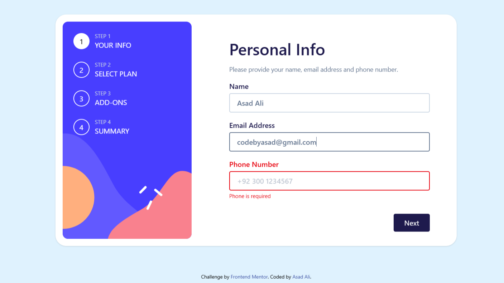

# Frontend Mentor - Multi-step Form

This is a solution to the [Multi-step form challenge on Frontend Mentor](https://www.frontendmentor.io/challenges/multistep-form-YVAnSdqQBJ). This project focuses on building an accessible, responsive, and user-friendly form.

🚀 **Live Demo:** [View on Vercel](https://your-live-site-url.com)  
📂 **GitHub Repo:** [View on GitHub](https://github.com/AsadAli-1122/multi-step-form.git)

## 📌 Features

✅ Multi-step form navigation 🔄  
✅ Responsive design for all screen sizes 📱💻  
✅ Accessible (a11y) elements for better UX ♿  
✅ Built with Next.js App Router for better performance ⚡  

## 🛠️ Built With

- **Next.js** – SSR & optimized routing
- **TypeScript** – Type safety & maintainability
- **Tailwind CSS** – Utility-first styling for a modern UI
- **React Hook Form** – Efficient form handling

## 🎯 Challenges & Learnings

- Designed **accessible form components** with proper focus states
- Ensured **mobile-first responsive UI** using Tailwind

## ✨ Author

🚀 **Asad Ali**  
🔗 [Portfolio](https://codebyasad.vercel.app) | 🐙 [GitHub](https://github.com/AsadAli-1122) | 💡 [Frontend Mentor](https://www.frontendmentor.io/profile/AsadAli-1122)  

